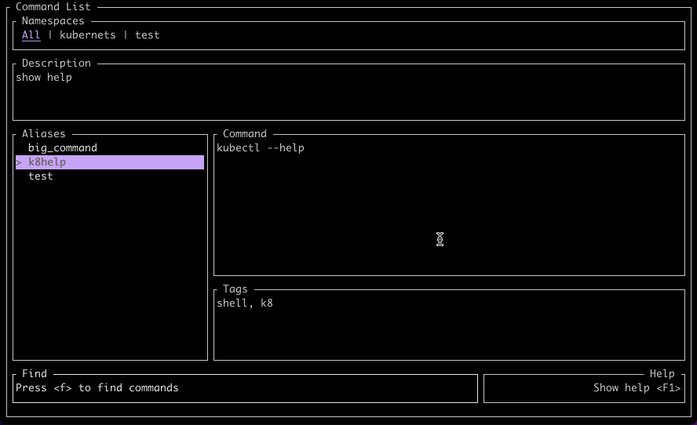

# cl

cl (short for **C**ommand **L**ist) is a way to group all your `aliases`, `once in a while commands` or `multiple commands with a lot of args` in an organized and human readable place

## how to install

### macOs (intel and silicon) and Linux using `homebrew`:

``` bash
$ brew tap rvigo/cl
$ brew install cl 
```

If you use ZSH, an autocomplete script will be installed with the application.

## usage

Using the application interface to add, edit, and run commands:
```bash
$ cl
```



Using the application's CLI to execute stored commands:
```bash
$ cl exec <your command alias>
```

If you are using the ZSH shell and [fzf](https://github.com/junegunn/fzf), a widget can be installed with `cl config zsh-widget --install`. After that, you can call the `exec` function (with some cool autocomplete features) pressing CTRL+O  
  
You can pass args and flags to the stored command:
```bash
# the stored command is `docker` and the alias is `d`
$ cl exec d -- ps # same as `docker ps` 
$ cl exec d -- ps --help # same as `docker ps --help` 
```

You can also set `variables` in your command and pass them as `named parameters`:
```bash
# the stored command is `echo "hello #{name}, #{greetings}"` and the alias is `echo`
# the parameters names should match the variables names in your command
$ cl exec echo -- --name="John Doe" --grettings "welcome!" 
> "hello John Doe, welcome!"
```


A more `real world` example: 
```bash
# the stored command is `aws-vault exec #{aws_account} -- #{command}` and the alias is `av_exec`
# note that you can mix the program flags and args with the named parameters
$ cl exec av_exec -- --aws_account="dev" --command="aws s3 ls" --duration=2h
```

Importing/exporting your aliases is possible using the `share` subcommand:
```bash
# the command bellow will generate the file `shared.toml` in the current working directory by default, with all aliases present in the `git` namespace as provided
$ cl share export --namespace git 
# the command bellow will import all aliases from a file in the specified location. 
# you can also choose which namespace will be imported
$ cl share import -f `path/to/shared.toml`
```
